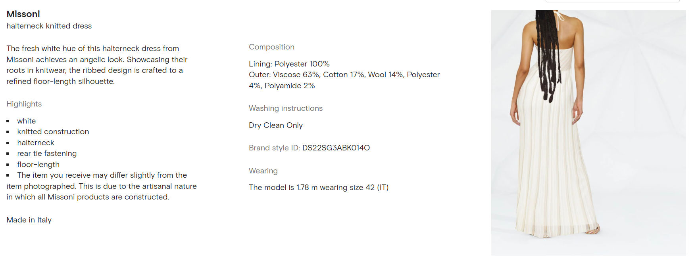
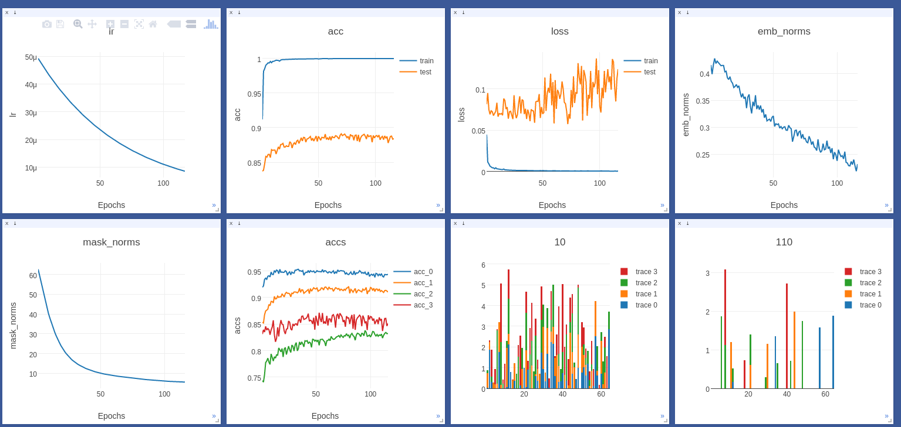
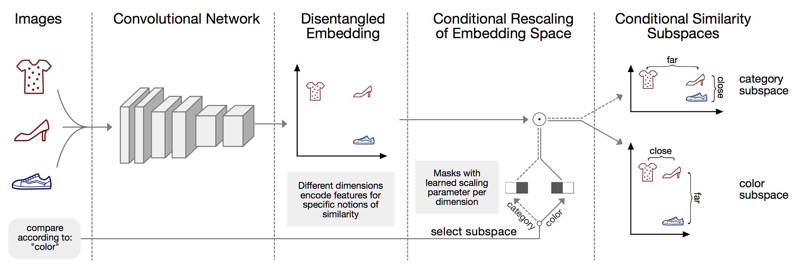

# Conditional Similarity Network (CSN) on Farfetch Dresses 

This repository is a fork of the official [Conditional Similarity Network](https://github.com/andreasveit/conditional-similarity-networks) repository, 
implementing the model in the [paper](https://arxiv.org/abs/1603.07810) presented at CVPR 2017. 

I did some refactoring and modified the code to train on [Farfetch dresses](https://www.farfetch.com/hk/shopping/women/dresses-1/items.aspx).
The model can be used for explainable similar product recommendation. The reason to choosing Farfetch is that their 
products are well annotated with detailed properties like color, sleeves, collar, etc, as shown in the following image:




## Data

### Download ready-to-use data
1. Go to this [Google Drive](https://drive.google.com/file/d/1SYQrE3oX3_OtgMOWv9EikXva9h7OMaPn/view?usp=sharing) link and download the zip file to the project directory
2. Unzip the file

### How I collected it


## Usage
The model can be trained with a simple command. The default run name is `csn_yyyymmdd_hhmmss`.
```sh
$ python src/main.py --tensorboard --name {name}
```

Full list of arguments:
```
PyTorch Conditional Similarity Network

optional arguments:
  -h, --help            show this help message and exit
  --data-dir N          directory to the training data (default: "data/farfetch")
  --batch-size N        input batch size for training (default: 512)
  --epochs N            number of epochs to train (default: 30)
  --start-epoch N       number of start epoch (default: 1)
  --lr x                learning rate (default: 5e-5)
  --seed N              random seed (default: 42)
  --cuda                enables CUDA training (default: True)
  --log-interval N      how many batches to wait before logging training status (default: 20)
  --margin MARGIN       margin for triplet loss (default: 0.2)
  --resume RESUME       path to latest checkpoint (default: None)
  --name NAME           name of experiment (default: "csn_yyyymmdd_hhmmss")
  --embed-loss-coeff x  loss coefficient for embedding norm (default: 5e-3)
  --mask-loss-coeff x   loss coefficient for mask norm (default: 5e-4)
  --train-triplets N    how many unique training triplets (default: 100000)
  --val-triplets N      how many unique validation triplets (default: 20000)
  --test-triplets N     how many unique test triplets (default: 40000)
  --embed-dim N         embedding dimension (default: 64)
  --test                to only run evaluation on test set (default: False)
  --learned             to learn masks from random initialization (default: True)
  --prein               to initialize masks to be disjoint (default: False)
  --tensorboard         use tensorboard to track and plot (default: False)
  --log-dir LOG_DIR     directory to save checkpoints & tensorboard data (default: "runs")
  --conditions [CONDITIONS ...]
                        set of similarity notions
```

Training progress can be easily tracked with [visdom](https://github.com/facebookresearch/visdom) using the `--visdom` flag. It keeps track of the learning rate, loss, training and validation accuracy both for all triplets as well as separated for each notion of similarity, the embedding norm, mask norm as well as the masks.



By default the training code keeps track of the model with the highest performance on the validation set. Thus, after the model has converged, it can be directly evaluated on the test set as follows
```sh
$ python src/main.py --test --resume runs/{name}/model_best.pth.tar
```


## Model Details
What makes images similar? To measure the similarity between images, they are typically embedded in a feature-vector space, in which their distance preserve the relative dissimilarity. However, when learning such similarity embeddings the simplifying assumption is commonly made that images are only compared to one unique measure of similarity.

[Conditional Similarity Networks](https://arxiv.org/abs/1603.07810) address this shortcoming by learning a nonlinear embeddings that gracefully deals with multiple notions of similarity within a shared embedding. Different aspects of similarity are incorporated by assigning responsibility weights to each embedding dimension with respect to each aspect of similarity.



Images are passed through a convolutional network and projected into a nonlinear embedding such that different dimensions encode features for specific notions of similarity. Subsequent masks indicate which dimensions of the embedding are responsible for separate aspects of similarity. We can then compare objects according to various notions of similarity by selecting an appropriate masked subspace.
